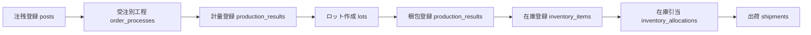

# ロット管理 再設計案

作成日: 2026-07-15

## 1. 背景

現在のシステムでは、工程の追跡単位は `posts` の注番です。計量登録時にロット番号を発行し、主に `posts.lot_no` に保持しています。

一方で、実運用では 1 つの注番から複数ロットが発生する可能性があります。代表例は、同じ注番の生産途中で材料ロットが切り替わるケースです。この場合、`posts.lot_no` に 1 つだけロット番号を持たせる設計では、計量、梱包、在庫、引当、出荷を正確に追跡できません。

そのため、ロット管理を独立した簡易マスタではなく、注番に紐づく生産・在庫・出荷の追跡単位として再設計します。

## 2. 再設計の基本方針

- `posts` は受注・注番・工程進捗の親データとして残す。
- `order_processes` はこれまで通り注番単位の工程進捗を管理する。
- `lots` は `posts` の子明細にする。
- 1 つの `posts.id` に対して複数の `lots` を持てるようにする。
- ロット番号は計量登録時に発行する。
- 計量実績はロット発生の起点にする。
- 梱包、在庫、引当、出荷はロット単位で追跡できるようにする。
- `posts.lot_no` は移行期間中の代表表示または旧互換用として扱い、最終的な正は `lots.lot_no` に寄せる。

## 3. 対象業務フロー



## 4. データ設計

### 4.1 lots

`lots` は注番の子明細として再定義します。

| カラム | 型 | 内容 |
| --- | --- | --- |
| `id` | uuid | ロットID |
| `post_id` | uuid | 親の注番。`posts.id` を参照 |
| `order_no` | text | 表示・検索用の注番 |
| `product_id` | uuid | 製品ID |
| `customer_id` | uuid | 得意先ID |
| `product_code` | text | 製品コード |
| `product_name` | text | 製品名 |
| `customer_name` | text | 得意先名 |
| `lot_no` | text | 計量登録時に発行するロット番号 |
| `material_lot_no` | text | 材料ロット番号。材料切替の識別用 |
| `measurement_result_id` | uuid | 起点になった計量実績 |
| `measurement_order_process_id` | uuid | 計量工程の受注別工程ID |
| `measured_amount` | integer | 計量数量 |
| `packaged_amount` | integer | 梱包済数量 |
| `inventory_amount` | integer | 在庫化された数量 |
| `allocated_amount` | integer | 引当済数量 |
| `shipped_amount` | integer | 出荷済数量 |
| `status` | text | ロット状態 |
| `measured_at` | date | 計量日 |
| `packaged_at` | date | 最終梱包日 |
| `last_shipped_at` | date | 最終出荷日 |
| `note` | text | 備考 |
| `created_at` | timestamptz | 作成日時 |
| `updated_at` | timestamptz | 更新日時 |

### 4.2 一意制約

初期案では、`lot_no` は注番内で一意とします。

```sql
unique (post_id, lot_no)
```

ただし、会社全体でロット番号を重複させない運用にする場合は、次の制約に変更します。

```sql
unique (lot_no)
```

この点は実装前に確認が必要です。

### 4.3 関連テーブルへの追加

ロット追跡を正確にするため、段階的に以下を追加します。

| テーブル | 追加候補 | 目的 |
| --- | --- | --- |
| `production_results` | `lot_id` | 計量・梱包実績をロットへ紐づける |
| `inventory_items` | `lot_id` | 在庫をロット単位で管理する |
| `inventory_allocations` | `lot_id` | 引当をロット単位で管理する |
| `shipments` | `lot_id` | 出荷をロット単位で管理する |

既存の `lot_no` カラムは、画面表示と移行中の互換用に残します。

## 5. ロット状態

ロット状態は、手入力ではなく数量から自動判定する方針にします。

| 状態 | 判定 |
| --- | --- |
| `measured` | 計量済、梱包前 |
| `packaging` | 一部梱包済 |
| `stocked` | 在庫あり、未引当 |
| `allocated` | 引当済、未出荷 |
| `partial_shipped` | 一部出荷済 |
| `shipped` | 出荷完了 |
| `cancelled` | 取消 |
| `hold` | 保留 |

表示名は日本語で表示します。

- 計量済
- 梱包中
- 在庫あり
- 引当済
- 一部出荷済
- 出荷完了
- 取消
- 保留

## 6. 画面仕様

### 6.1 ロット管理画面の役割

ロット管理画面は、ロット番号を手作業で作る画面ではなく、計量登録以降に発生したロットの状態を確認する画面に変更します。

主な目的は次の通りです。

- 1 注番に複数ロットがあるか確認する。
- 材料ロット切替の履歴を追跡する。
- 計量、梱包、在庫、引当、出荷の数量差を確認する。
- ロット単位で現在どこまで進んでいるか確認する。

### 6.2 一覧項目

| 項目 | 内容 |
| --- | --- |
| 状態 | ロット状態 |
| ロットNo | 計量登録時に発行したロット番号 |
| 材料ロットNo | 材料切替時の識別番号 |
| 注番 | 親の注番 |
| 製品コード | 製品コード |
| 製品名 | 製品名 |
| 得意先 | 得意先名 |
| 計量数 | 計量済数量 |
| 梱包数 | 梱包済数量 |
| 在庫数 | 現在在庫数 |
| 引当数 | 引当済数量 |
| 出荷数 | 出荷済数量 |
| 残数 | 計量数から出荷数を引いた数量 |
| 計量日 | 計量日 |
| 最終梱包日 | 最終梱包日 |
| 最終出荷日 | 最終出荷日 |

### 6.3 操作

| 操作 | 内容 |
| --- | --- |
| 詳細 | ロットの工程履歴、在庫、引当、出荷履歴を表示 |
| 編集 | 材料ロットNo、備考など追跡補助項目を修正 |
| 取消 | 下流データがない場合のみ可能 |

ロットは実績・在庫・出荷の根拠になるため、通常の物理削除は避けます。削除が必要な場合も、梱包・在庫・引当・出荷が存在しないロットに限定します。

## 7. 登録フロー

### 7.1 計量登録

1. 計量対象の注番・工程を選択する。
2. 計量数量を入力する。
3. ロット番号を自動採番する。
4. 必要に応じて材料ロットNoを入力する。
5. `production_results` に計量実績を登録する。
6. `lots` にロット明細を作成する。
7. 計量だけでは `inventory_items.current_stock` を増やさない。

### 7.2 梱包登録

1. 梱包対象の注番を選択する。
2. 未梱包のロットを選択する。
3. 梱包数量を入力する。
4. `production_results` に梱包実績を登録する。
5. `lots.packaged_amount` を更新する。
6. `inventory_items` に `lot_id` 付きで在庫を登録または加算する。

### 7.3 在庫引当

1. 出荷対象の注番を選択する。
2. 引当可能なロット別在庫を表示する。
3. ロット単位で引当数量を決める。
4. `inventory_allocations.lot_id` を登録する。
5. `lots.allocated_amount` を更新する。

### 7.4 出荷

1. 引当済ロットを表示する。
2. 出荷数量を入力する。
3. `shipments.lot_id` を登録する。
4. `lots.shipped_amount` を更新する。
5. 在庫と引当数を減算する。

## 8. ガントチャート・進捗管理との関係

ガントチャートと進捗管理は、引き続き注番単位で表示します。工程進捗は `order_processes` を基準にします。

ロットは、計量以降の品質・在庫・出荷トレースの詳細単位です。そのため、ガントチャートの工程バーをロット単位に分割する必要はありません。

ただし、詳細表示では次の情報を出せるようにします。

- 対象注番に紐づくロット一覧
- 各ロットの計量数、梱包数、在庫数、出荷数
- 材料ロット切替の有無

## 9. 移行計画

### Phase 1: DB準備

- `lots` に `post_id`、数量、材料ロット、実績リンクを追加する。
- `production_results`、`inventory_items`、`inventory_allocations`、`shipments` に `lot_id` を追加する。
- 既存データから `posts.lot_no` を使って暫定ロットを作成するSQLを用意する。
- ロット状態確認用ビュー `v_lot_flow_status` を作成する。

### Phase 2: 計量登録

- 計量登録時に `lots` を作成する。
- 同一注番で複数回計量した場合、複数ロットを作れるようにする。
- `posts.lot_no` は代表ロット表示としてのみ更新する。

### Phase 3: 梱包登録

- 梱包対象を注番だけでなくロットから選択できるようにする。
- 梱包実績に `lot_id` を持たせる。
- 在庫登録時に `inventory_items.lot_id` を設定する。

### Phase 4: 在庫引当・出荷

- 在庫引当をロット単位にする。
- 出荷をロット単位にする。
- 1 回の出荷で複数ロットを出す場合は、将来的に出荷明細テーブルを検討する。

### Phase 5: 旧仕様整理

- `posts.lot_no` を正データとして使わないようにする。
- 既存画面の `lot_no` 参照を `lots` または `lot_id` 参照へ段階的に置き換える。
- ロット管理画面を手入力マスタからトレーサビリティ画面へ変更する。

## 10. 実装上の注意

- 既存の計量表出力、計量履歴、出荷管理、在庫管理は `posts.lot_no` 依存があるため、一度に置き換えない。
- 移行期間は `lot_id` と `lot_no` の両方を保持する。
- 既存データに `lot_id` がない場合でも動くよう、ビュー側で `lot_no` から補完する。
- ロット削除は原則禁止し、取り消し状態で管理する。
- 下流データが存在するロットの数量修正は、直接上書きではなく補正登録にするのが望ましい。

## 11. 未確定事項

実装前に確認が必要な事項です。

1. ロット番号は会社全体で一意にしますか。それとも注番内で一意にしますか。
2. 1 回の計量登録で複数ロットを同時に作る必要がありますか。
3. 材料ロットNoは自由入力で十分ですか。それとも材料ロットマスタが必要ですか。
4. 1 つの計量ロットを梱包時にさらに分割する可能性はありますか。
5. 計量数と梱包数に差が出た場合、歩留まり・不良・端数として記録しますか。
6. 下流データがあるロットの取消・修正をどこまで許可しますか。

## 12. 推奨する最初の実装範囲

最初は Phase 1 と Phase 2 までを実装します。

- DBに `post_id` を持つロット構造を追加する。
- 計量登録時に `lots` を作成する。
- ロット管理画面を `lots` 一覧表示に変更する。
- 梱包、在庫、引当、出荷は既存仕様を壊さないよう、まだ `posts.lot_no` 互換で動かす。

この範囲であれば、現在の業務フローを壊さずに、1 注番複数ロットへ移行する土台を作れます。

## 13. 次のAIへの引き継ぎ事項

- ロット管理は、注番 `posts` の子明細 `lots` として再設計する。
- 工程進捗は引き続き `order_processes` を基準にする。
- ロット番号は計量登録時に発行する方針を維持する。
- 1 注番から複数ロットが発生する前提で設計する。
- 梱包、在庫、引当、出荷は最終的に `lot_id` で追跡する。
- 最初の実装は Phase 1 と Phase 2 を推奨する。
- 実装前に、ロット番号の一意範囲、材料ロットNoの扱い、数量差の扱いをユーザーに確認する。
