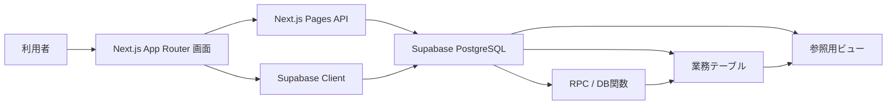
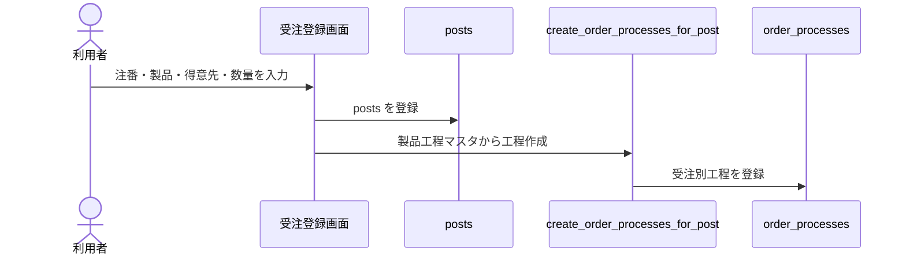
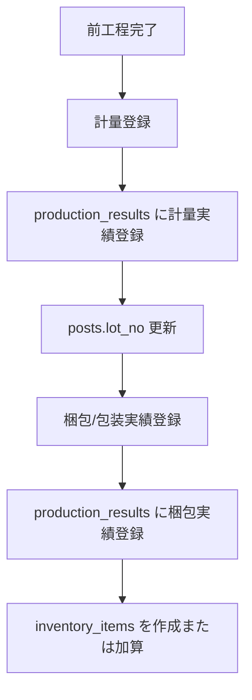

# 現行システム設計書

最終更新日: 2026-07-07

## 1. 目的

本システムは、注残登録から受注別工程、生産予定、実績登録、計量、梱包後在庫登録、在庫引当、出荷までを一元管理する社内向け生産管理システムである。

現在の実装では、作業対象の基準を `posts` の有効な注残に統一する。削除済み、最終工程完了済み、または全数出荷済みの注残は、注残管理・生産予定・受注別工程管理・実績管理などの作業画面には表示しない。

## 2. 技術構成

| 区分 | 採用技術 |
| --- | --- |
| フロントエンド | Next.js 16.2.6 App Router, React 19.2.4, TypeScript |
| API | Next.js Pages API |
| データベース | Supabase PostgreSQL |
| DBアクセス | `@supabase/supabase-js` |
| UI補助 | MUI, lucide-react, dnd-kit, react-google-charts |
| PDF/帳票 | jsPDF, jspdf-autotable |
| テスト/検証 | Supabase SQL checks, ESLint, Next.js build |

## 3. システム構成



## 4. 主要画面

| 画面 | パス | 主な役割 |
| --- | --- | --- |
| 受注登録 | `/create` | 注番を `posts` に登録し、製品工程マスタから `order_processes` を作成する |
| 注残管理 | `/orders` | 有効注残の一覧、在庫引当、削除、進捗確認への入口 |
| 受注別工程管理 | `/orderProcesses` | 注残ごとの工程確認、追加、編集、削除、並び替え、製品工程マスタ同期 |
| 生産予定 | `/productionSchedules` | 有効注残を基準に日別生産予定を表示・編集する |
| 実績管理 | `/productionResults` | 製造・洗浄・検査・梱包などの工程実績を登録する |
| 計量登録 | `/manufacturing` | 計量工程の実績登録と `posts.lot_no` の更新を行う |
| 計量表 | `/weighingReport` | 計量実績を帳票用に表示・出力する |
| 進捗管理 | `/progress/[id]` | 注残単位の工程進捗とガントチャートを表示する |
| 外注管理 | `/outsourcing` | 外注工程の状態、発送日、戻り日などを管理する |
| 在庫管理 | `/inventoryMaster` | 梱包完了後に登録された在庫を管理する |
| 出荷管理 | `/shipping` | 引当済み在庫を出荷し、出荷履歴を登録する |
| 各種マスタ | `/productMaster`, `/customerMaster`, `/processMaster`, `/productProcessMaster` | 製品、得意先、工程、製品工程を管理する |

## 5. 業務フロー

### 5.1 受注登録から工程作成



### 5.2 生産予定

1. `/api/daily-production` が有効注残を取得する。
2. `production_schedules` の手動予定と日別対象を画面で統合表示する。
3. 削除済み、最終工程完了済み、全数出荷済みの注残に紐づく予定は作業対象に出さない。

### 5.3 実績登録

1. 実績管理画面は有効注残と `order_processes` を対象にする。
2. 実績登録は `register_order_process_result` RPC に集約する。
3. RPC は `production_results` を登録し、対象 `order_processes.completed_amount` を更新する。
4. 通常工程では前工程の完了数を超えて登録できない。
5. 外注工程では外注戻りや計画数を考慮して登録可能数量を緩和する。

### 5.4 計量と梱包



計量工程は在庫を増やさない。梱包/包装工程の実績登録時に、ロットNo付きの在庫として `inventory_items` を作成または加算する。

業務ルールとして、梱包/包装の前には必ず計量工程を入れる。製品工程マスタにも、梱包/包装より前に計量工程を設定することを標準とする。

### 5.5 在庫引当と出荷

1. 注残管理から `confirm_inventory_allocation(post_id)` を実行する。
2. 引当可能な `inventory_items.current_stock - allocated_stock` を古い在庫から引き当てる。
3. `inventory_allocations` を作成し、`inventory_items.allocated_stock` を増やす。
4. 出荷画面で数量を指定し、`ship_inventory_for_post(post_id, quantity)` を実行する。
5. RPC が在庫と引当数を減算し、その後 `/api/shipments` が `shipments` を登録する。
6. 出荷数量は引当数、注残数、在庫数を超えない。

### 5.6 注残削除

注残削除は物理削除ではなく `soft_delete_order_post(post_id)` に集約する。

このRPCは、未出荷引当の `allocated_stock` を戻したうえで、対象注残に紐づく `order_processes`、`production_results`、`production_schedules`、`shipments`、`inventory_allocations` を削除し、`posts.delete = true` にする。

## 6. 主要データベーステーブル

| テーブル | 役割 |
| --- | --- |
| `posts` | 注残の親データ。注番、製品、得意先、数量、納期、ロットNo、削除フラグを保持する |
| `product_master` | 製品マスタ |
| `customer_master` | 得意先マスタ |
| `process_master` | 工程マスタ |
| `product_processes` | 製品ごとの標準工程マスタ |
| `order_processes` | 注残ごとの工程。工程順、計画数、完了数、外注状態などを保持する |
| `production_results` | 工程実績。現在の実績登録の中心テーブル |
| `production_schedules` | 生産予定 |
| `inventory_items` | ロット別在庫。梱包/包装完了時に登録・加算される |
| `inventory_allocations` | 注残に対する在庫引当 |
| `shipments` | 出荷実績 |
| `lots` | ロット管理用テーブル |
| `subcontractors` | 外注先マスタ |

## 7. 主要ビュー

| ビュー | 用途 |
| --- | --- |
| `v_posts_with_master` | 注残に製品・得意先情報と派生ステータスを付与する |
| `v_product_master_with_customer` | 製品と得意先の表示用結合 |
| `v_product_processes_with_master` | 製品工程マスタの表示用結合 |
| `v_order_processes_with_master` | 受注別工程に注残・製品・工程・外注先情報を付与する |
| `v_production_results_with_master` | 実績に注残・製品・工程情報を付与する |
| `v_production_schedules_with_master` | 生産予定の表示用結合 |
| `v_inventory_items_with_master` | 在庫に製品情報を付与する |
| `v_inventory_allocations_with_master` | 引当情報に注残・在庫・製品情報を付与する |
| `v_shipments_with_master` | 出荷実績に注残・製品・得意先情報を付与する |
| `v_post_process_progress` | 注残ごとの工程進捗表示に使う |

## 8. 主要RPC / DB関数

| 関数 | 役割 |
| --- | --- |
| `create_order_processes_for_post(post_id)` | 製品工程マスタから受注別工程を作成する |
| `register_order_process_result(order_process_id, amount, ...)` | 工程実績登録、工程完了数更新、梱包時の在庫登録を一括で行う |
| `confirm_inventory_allocation(post_id)` | 注残に対して在庫を引き当てる |
| `ship_inventory_for_post(post_id, quantity)` | 引当済み在庫を優先して在庫を減算する |
| `soft_delete_order_post(post_id)` | 注残の論理削除と関連作業データの整理を行う |
| `reorder_order_processes(post_id, ordered_ids)` | 受注別工程の工程順を更新する |
| `sync_order_processes_from_product_master(post_id)` | 製品工程マスタから受注別工程を同期する |

## 9. API一覧

| API | メソッド | 主な用途 |
| --- | --- | --- |
| `/api/daily-production` | GET | 有効注残を基準に日別生産対象を取得する |
| `/api/daily-production` | POST | 生産予定を登録する |
| `/api/production-schedules` | GET | 有効注残に紐づく生産予定を取得する |
| `/api/production-schedules` | POST | 生産予定を登録する |
| `/api/production-schedules` | PUT | 生産予定を更新する |
| `/api/production-schedules` | DELETE | 生産予定を削除する |
| `/api/shipments` | GET | 出荷実績を取得する |
| `/api/shipments` | POST | 在庫減算RPCを実行し、出荷実績を登録する |

## 10. 状態管理

`posts` の表示ステータスは、保存された単一の状態列だけではなく、出荷数、工程完了数、外注状態から派生して判断する。

主な判定順は以下の通り。

1. 出荷数が注残数以上なら `出荷OK`
2. 外注工程が外注済みまたは外注中なら外注状態を表示
3. 最終工程の完了数が注残数以上なら完了扱い
4. 進行中の工程があればその工程状態を表示
5. それ以外は未着手扱い

作業画面では、有効注残のみを対象とする。有効注残とは、削除されておらず、最終工程が未完了で、全数出荷も完了していない注残である。

## 11. 制約とバリデーション

| 対象 | ルール |
| --- | --- |
| 受注登録 | 注番の重複を許可しない |
| 受注別工程 | 工程順は1から連番で重複しない |
| 実績登録 | 数量は正の値のみ登録できる |
| 実績登録 | ロック済み工程は変更できない |
| 通常工程 | 前工程完了数を超えて登録できない |
| 計量工程 | 在庫を増やさない |
| 梱包/包装工程 | 事前に計量工程を完了している必要がある |
| 梱包/包装工程 | `posts.lot_no` が必要 |
| 梱包/包装工程 | 梱包完了数を `inventory_items` に反映する |
| 在庫引当 | 引当可能在庫を超えて引当できない |
| 出荷 | 注残数、引当数、在庫数を超えて出荷できない |
| 注残削除 | 関連作業データを整理し、作業画面から除外する |

## 12. RLS / 権限

確認時点では `production_results` のRLSが有効で、`posts`、`order_processes`、`inventory_items`、`inventory_allocations`、`shipments` などはRLS無効として確認されている。

`register_order_process_result` は `security definer` で実装され、画面からの実績登録時にRLSの影響を受けにくい構成にしている。今後RLSを拡張する場合は、RPC経由で更新する範囲と、画面から直接参照・更新する範囲を分けて設計する。

## 13. ディレクトリ構成

```text
kawane-app/
  app/
    create/                  受注登録
    orders/                  注残管理
    orderProcesses/          受注別工程管理
    productionSchedules/     生産予定
    productionResults/       実績管理
    manufacturing/           計量登録
    progress/[id]/            進捗管理
    outsourcing/             外注管理
    inventoryMaster/         在庫管理
    shipping/                出荷管理
    type.ts                  画面共通型定義
    utills/                  共通取得・進捗計算処理
  pages/api/
    daily-production.ts
    production-schedules.ts
    shipments.ts
  supabase/
    migrations/              DB変更・RPC・ビュー定義
    checks/                  SQL確認スクリプトと確認レポート
  docs/
    current_system_design.md
```

## 14. 確認済みテスト

`supabase/checks` 配下のクロス画面シナリオで、以下の流れを確認済みである。

| シナリオ | 確認内容 | 状態 |
| --- | --- | --- |
| A | 受注登録から受注別工程作成 | 確認済み |
| B | 工程実績登録、計量、梱包、在庫登録 | 確認済み |
| C | 在庫引当、出荷、出荷後の注残非表示 | 確認済み |
| D | 注残削除と関連作業データ整理 | 確認済み |
| E | 有効注残のみ作業画面に表示すること | 確認済み |

追加で、注残管理・生産予定・受注別工程管理の3画面について、無効注残が表示されないことを画面確認済みである。

## 15. 実装上の注意

1. 作業画面の取得条件は、有効注残を基準に統一する。
2. `posts.delete = true` の注残は履歴用途以外では表示しない。
3. 最終工程完了済みまたは全数出荷済みの注残は、作業対象一覧から除外する。
4. 実績登録は可能な限り `register_order_process_result` に集約する。
5. 計量は工程実績であり、在庫登録ではない。
6. 在庫登録は梱包/包装実績登録時のみ行う。
7. 梱包前には必ず計量工程を設定し、製品工程マスタでもその順序を維持する。
8. 出荷時の在庫減算は `ship_inventory_for_post` に集約する。
9. 注残削除は `soft_delete_order_post` を使い、画面側で個別に関連データを削除しない。
10. 新しい画面やAPIを追加する場合は、保存テーブルを直接読むよりも、既存ビューを優先して利用する。
