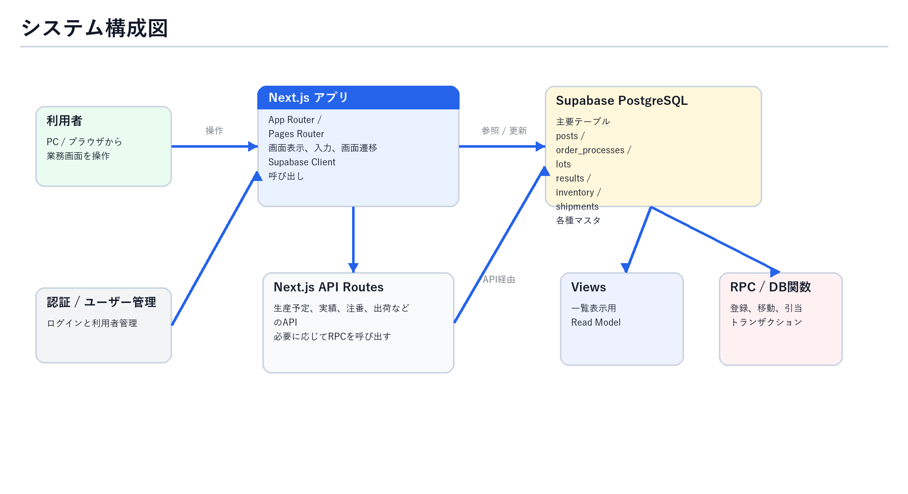
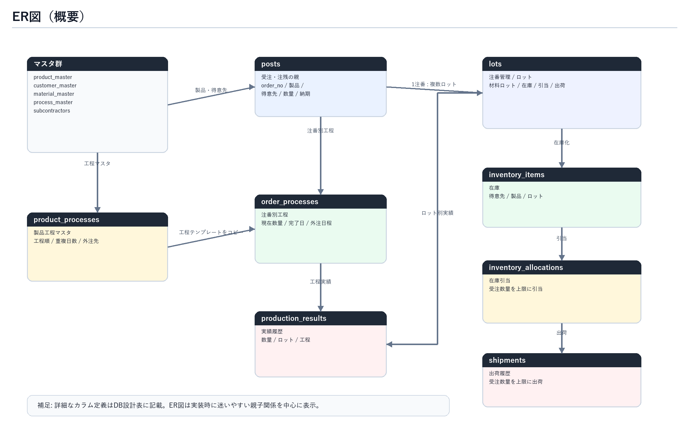
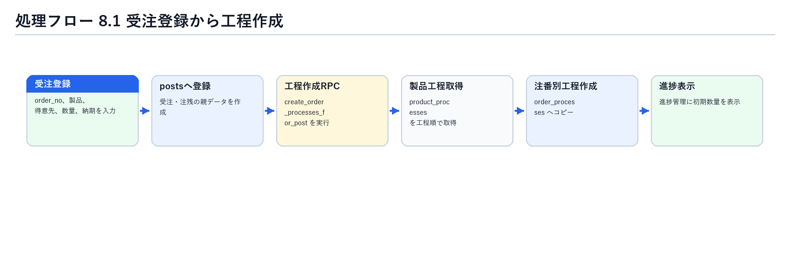
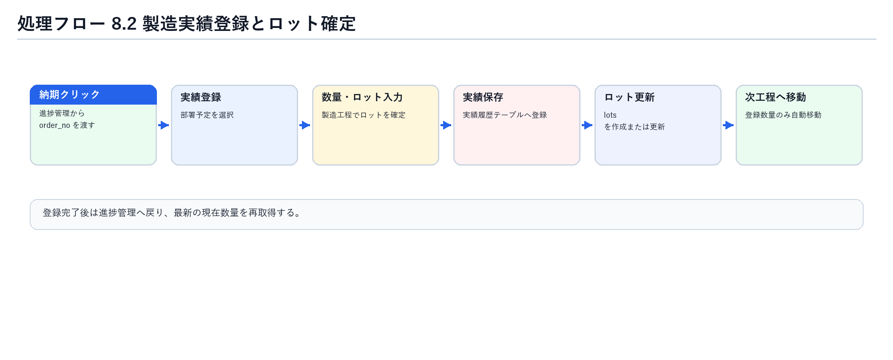
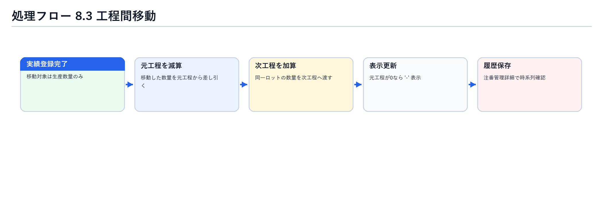
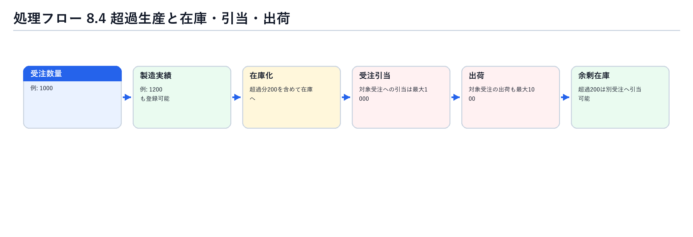
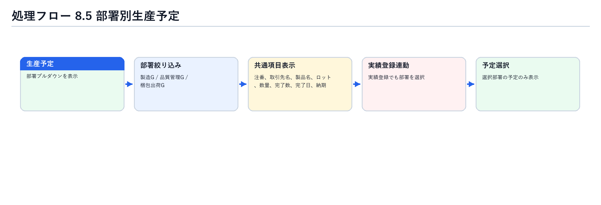

# 進捗・注番管理改修 システム設計書

作成日: 2026年8月19日  
対象システム: kawane-app  
対象範囲: 進捗管理、実績登録、生産予定、在庫マスタ、注番管理、工程間移動、超過生産、部署別表示  
前工程成果物: requirements_progress_lot_revision_20260802.md / requirements_progress_lot_revision_20260818.docx

## 1. 設計方針

- 本設計書は、確定済みの要件定義を実装可能な単位へ落とし込む。
- 進捗管理は、工程ごとの累計実績ではなく、注番・ロットごとの現在数量を把握する画面として設計する。
- 製造工程でロットを確定し、実績登録完了時に生産数量のみを次工程へ自動移動する。
- 製造工程と洗浄工程はDB上は別工程として保持し、画面表示上のみ「製造・洗浄」としてまとめる。
- 注番数量を超える生産は許可し、超過分は在庫として扱い、引当可能とする。
- 出荷数量および受注に対する引当数量は、受注数量を上限とする。
- 計量登録、計量表出力は通常運用から廃止し、数量入力は進捗管理または実績登録へ集約する。

## 2. システム構成図

図2-1 システム構成図。利用者、Next.js、API、Supabase、ビュー、RPCの接続関係を示す。

## 3. 主要画面構成

| 画面 | パス | 機能 |
| --- | --- | --- |
| ホーム | `/` | 主要機能への導線を表示する |
| 進捗管理 | `/progress` | 注番単位で在庫数、引当数、残数、各工程の現在数量、合計を表示する |
| 進捗詳細 / 工程ガント | `/progress/[id]` | 対象注番の工程ガント、実績、残工程予測を表示する |
| 実績登録 | `/productionResults` | 部署別生産予定を選択し、数量とロットを登録する |
| 生産予定 | `/productionSchedules` | 部署別に生産予定を表示する |
| 在庫マスタ | `/inventoryMaster` | 製品、ロット、得意先、在庫数、引当数、残数を管理する |
| 注番管理 | `/lots` | 旧ロット管理。注番を軸にロット、在庫、出荷、工程移動履歴を確認する |
| 注番詳細 | `/lots/[id]` | 対象ロットまたは注番の基本情報と時系列履歴を表示する |
| 削除済みロット一覧 | `/lots/deleted` | 論理削除済みロットの復元、完全削除を行う |
| 受注登録 | `/orders` | 受注登録を行う。CSV入力は後続追加用のボタンのみ配置する |
| 外注管理 | `/outsourcing` | 外注工程の出し日、予定日、実績日、メモを管理する |
| 各マスタ | `/productMaster`, `/customerMaster`, `/processMaster`, `/productProcesses`, `/materialMaster`, `/subcontractors`, `/lineMaster` | 製品、得意先、工程、製品工程、材料、外注先、工程能力を管理する |

## 4. ER図

図4-1 ER図。注番を中心に、工程、ロット、在庫、引当、出荷、各マスタの関係を示す。

## 5. DB設計

### 5.1 中核テーブル

| テーブル | 用途 | 主な項目 |
| --- | --- | --- |
| `posts` | 受注、注残の親データ | `id`, `order_no`, `product_id`, `customer_id`, `order_amount`, `delivery_date`, `delete` |
| `order_processes` | 注番別工程。製品工程マスタから作成される | `post_id`, `product_process_id`, `process_name`, `process_order`, `planned_amount`, `completed_amount`, `overlap_days` |
| `production_results` | 実績登録履歴 | `post_id`, `order_process_id`, `lot_id`, `date`, `amount` |
| `lots` | 注番配下のロット情報 | `post_id`, `lot_no`, `material_lot_no`, `measured_amount`, `packaged_amount`, `inventory_amount`, `allocated_amount`, `shipped_amount`, `deleted` |
| `inventory_items` | 在庫情報 | `product_id`, `lot_id`, `product_code`, `lot_no`, `current_stock`, `allocated_stock` |
| `inventory_allocations` | 受注に対する在庫引当 | `post_id`, `inventory_item_id`, `lot_id`, `allocated_amount`, `shipped_amount` |
| `shipments` | 出荷履歴 | `post_id`, `lot_id`, `order_no`, `quantity`, `delivery_date` |

### 5.2 マスタテーブル

| テーブル | 用途 | 主な項目 |
| --- | --- | --- |
| `product_master` | 製品マスタ | `product_code`, `product_name`, `customer_id`, `standard`（材料コード）, `unit_weight` |
| `customer_master` | 得意先マスタ | `customer_name`, `shipping_offset_days`, `note` |
| `material_master` | 材料マスタ | `material_code`, `material_number`, `material_name`, `size`, `remaining_amount` |
| `process_master` | 工程マスタ | `process_id`, `name`, `sort`, `enabled`, `outsourcing` |
| `product_processes` | 製品工程マスタ | `product_id`, `product_code`, `process_master_id`, `process_name`, `process_order`, `overlap_days`, `subcontractor_id` |
| `subcontractors` | 外注先マスタ | `name`, `process_name` |
| `line_master` | 工程能力設定 | `process_id`, `daily_capacity`, `operation_rate`, `enabled` |
| `company_calendar` | 休日マスタ | `date`, `name`, `is_holiday`, `type` |
| `ai_prediction_settings` | AI予測設定 | 予測対象、強さ、補正要素 |

### 5.3 ビュー

| ビュー | 用途 |
| --- | --- |
| `v_product_master_with_customer` | 製品と得意先を結合して表示する |
| `v_product_material_master` | 製品と材料を材料コードで結合し、材番、材料名、サイズ、残量、単重を取得する |
| `v_product_processes_with_master` | 製品工程、工程マスタ、外注先を結合して表示する |
| `v_order_processes_with_master` | 注番別工程、受注、製品、得意先、外注先を結合して表示する |
| `v_production_results_with_master` | 実績、注番、工程、製品、得意先を結合して表示する |
| `v_production_schedules_with_master` | 生産予定、受注、製品、得意先を結合して表示する |
| `v_inventory_items_with_master` | 在庫、製品、得意先を結合して表示する |
| `v_inventory_allocations_with_master` | 引当、受注、在庫、得意先を結合して表示する |
| `v_shipments_with_master` | 出荷、受注、製品、得意先を結合して表示する |
| `v_lot_flow_status` | ロット単位の計量、梱包、在庫、引当、出荷の状態を集約する |

### 5.4 追加または変更が必要なDB設計

- 進捗管理の直接編集履歴は、既存の履歴テーブルへ保存する。
- 既存履歴テーブルに不足がある場合、最小項目として `before_amount`, `after_amount`, `edited_by`, `edited_at`, `edit_reason` 相当の項目を追加する。
- 工程間移動履歴は、注番管理の詳細画面で時系列確認できる形式で保持する。
- 実績登録完了時、登録数量のみを元工程から次工程へ移動した履歴を残す。
- 部署別生産予定は部署のみで絞り込む。日付、工程による絞り込みは本設計の対象外とする。

## 6. RPC / DB関数設計

| 関数 | 用途 | 主な仕様 |
| --- | --- | --- |
| `create_order_processes_for_post(p_post_id)` | 受注登録後、製品工程マスタから注番別工程を作成する | `product_processes` を `process_order` 順に `order_processes` へコピーする |
| `sync_order_processes_from_product_master(p_post_id)` | 製品工程マスタの内容を注番別工程へ同期する | 実績済みまたはロック済み工程は更新しない |
| `register_order_process_result(...)` | 実績登録を行う | 数量とロットを登録し、生産数量のみ次工程へ移動する |
| `confirm_inventory_allocation(p_post_id)` | 受注に対して在庫引当を行う | 引当可能在庫から受注数量を上限に引当する |
| `ship_inventory_for_post(p_post_id, p_quantity)` | 出荷時に在庫を減算する | 引当済み在庫を優先し、受注数量を超えない |
| `soft_delete_lot(p_lot_id)` | ロットを論理削除する | 通常一覧から除外し、削除済み一覧へ表示する |
| `restore_deleted_lot(p_lot_id)` | 削除済みロットを復元する | `deleted=false` に戻す |
| `permanently_delete_lot(p_lot_id)` | 削除済みロットを完全削除する | 削除済み状態のロットのみ対象にする |

## 7. API設計

| API | メソッド | 用途 | 備考 |
| --- | --- | --- | --- |
| `/api/daily-production` | GET | 生産予定を取得する | 部署パラメータで表示対象を切り替える |
| `/api/daily-production` | POST | 生産予定を登録する | 既存の手入力登録を維持する |
| `/api/results` | GET | 実績履歴を取得する | `v_production_results_with_master` を参照する |
| `/api/results` | POST | 実績を登録する | 原則としてRPC経由へ寄せる |
| `/api/results` | PUT | 実績を修正する | 直接編集履歴を残す |
| `/api/results` | DELETE | 実績を削除する | 関連数量の再計算を伴う場合はRPC化する |
| `/api/lots` | GET | 注番 / ロット一覧を取得する | 通常一覧は `deleted=false` のみ |
| `/api/lots` | POST | ロットを登録する | 製造工程の実績登録時に作成される |
| `/api/lots` | PUT | ロット情報を更新する | 履歴整合性に注意する |
| `/api/lots` | DELETE | ロットを削除する | 物理削除ではなく `soft_delete_lot` を使用する |
| `/api/shipments` | GET/POST/PUT/DELETE | 出荷管理 | 引当、在庫、出荷数量の整合性を維持する |
| `/api/masters/product-processes` | GET/POST/PUT/DELETE | 製品工程マスタ | 工程マスタ、外注先マスタと連動する |
| `/api/masters/subcontractors` | GET/POST/PUT/DELETE | 外注先マスタ | 工程名で外注工程と紐づける |

## 8. 主要処理フロー

### 8.1 受注登録から工程作成

図8-1 受注登録から注番別工程作成までの処理フロー。

### 8.2 製造実績登録とロット確定

図8-2 製造実績登録、ロット確定、次工程移動までの処理フロー。

### 8.3 工程間移動

図8-3 実績登録後に生産数量のみを次工程へ移動する処理フロー。

### 8.4 超過生産と在庫・引当・出荷

図8-4 超過生産分を在庫化し、引当と出荷を受注数量上限で制御する処理フロー。

### 8.5 部署別生産予定

図8-5 部署別生産予定を部署のみで絞り込み、実績登録へ連動する処理フロー。

## 9. 進捗管理設計

### 9.1 表示項目

表示順は以下とする。

1. 注番
2. 得意先
3. 製品名
4. 受注数量
5. 納期
6. 在庫数
7. 引当数
8. 残数
9. 在庫差引数量
10. 製造・洗浄
11. メッキなど外注工程
12. 検査
13. 合計
14. 梱包
15. 工程進捗

### 9.2 数量表示ルール

- 各工程欄は、対象工程に現在存在している数量を表示する。
- 工程ごとの累計実績は表示しない。
- 登録済み数量が次工程へ移動した場合、元工程は移動済み数量を表示せず、残数量がなければ `-` を表示する。
- 合計欄は、全工程の現在数量合計を表示する。
- 在庫差引数量は、在庫合計から受注数量を引いた数量を表示する。
- ステータス表示は廃止し、在庫数、引当数、残数を表示する。

### 9.3 直接編集

- 進捗管理画面上で数量を直接編集できる。
- 編集時は、注番、ロット、工程、編集前数量、編集後数量、編集者、編集日時、編集理由を履歴に残す。
- 直接編集は例外操作として扱い、通常の工程移動履歴と区別できるようにする。

## 10. 実績登録設計

- 登録対象は、納期クリックで渡された `order_no` を主キーとして特定する。
- 実績登録画面にも部署プルダウンを配置する。
- 部署プルダウンで選択した部署に応じて、デイリー予定の製品選択リストを切り替える。
- 製造実績で登録する項目は数量とロットを基本とする。
- 工程移動の対象は生産数量のみとする。
- 登録完了後は進捗管理へ戻り、登録内容が反映された最新状態を表示する。

## 11. 生産予定設計

- 対象部署は「製造G」「品質管理G」「梱包出荷G」とする。
- 部署選択はプルダウン方式とする。
- 絞り込み条件は部署のみとする。
- 全部署共通で、表示項目と表示順は以下とする。

| 順 | 項目 |
| --- | --- |
| 1 | 注番 |
| 2 | 取引先名 |
| 3 | 製品名 |
| 4 | ロット |
| 5 | 数量 |
| 6 | 完了数 |
| 7 | 完了日 |
| 8 | 納期 |

## 12. 注番管理設計

- 旧ロット管理画面は注番管理へ名称変更する。
- 一覧には注番、得意先、製品名、ロット、材料ロット、数量、在庫、引当、出荷、残数を表示する。
- 状態カラムは不要とする。
- 詳細画面では、上部に基本情報、下部に時系列履歴を表示する。
- 時系列履歴には、製造、洗浄、外注、検査、梱包、在庫登録、引当、出荷、直接編集を含める。
- 削除は通常削除ではなく論理削除とし、削除済みロット一覧で復元または完全削除できる。

## 13. 在庫・引当・出荷設計

- 在庫マスタには得意先を表示する。
- 超過生産分も在庫として扱う。
- 引当は在庫の空き数量に対して実行できる。
- 受注に対する引当数量は受注数量を上限とする。
- 出荷数量も受注数量を上限とする。
- 在庫引当後の未出荷数量は `inventory_allocations.allocated_amount - shipped_amount` で管理する。

## 14. 工程・ガント設計

- 製品工程マスタの `overlap_days` を工程の重複日数として使用する。
- ガントチャートは、実績と残り工程の完了日予測を表示する。
- 今日の日付は青線、出荷日は赤線で表示する。
- 休日マスタを考慮し、休日は作業日から除外する。
- 工程能力設定は工程ごとの生産能力、負荷予測、ガント予測の補正に利用する。
- 工程マスタの外注チェックが有効な工程は、外注先マスタから候補を取得する。

## 15. 実装対象ファイル

| 領域 | 主なファイル |
| --- | --- |
| 進捗管理 | `app/progress/page.tsx`, `app/progress/[id]/page.tsx`, `app/components/GenttChart/GenttChart.tsx` |
| 実績登録 | `app/productionResults/page.tsx`, `pages/api/results.ts` |
| 生産予定 | `app/productionSchedules/page.tsx`, `pages/api/daily-production.ts`, `pages/api/production-schedules.ts` |
| 注番管理 | `app/lots/page.tsx`, `app/lots/[id]/page.tsx`, `app/lots/deleted/page.tsx`, `pages/api/lots.ts` |
| 在庫・出荷 | `app/inventoryMaster/page.tsx`, `app/shipping/page.tsx`, `pages/api/shipments.ts` |
| マスタ | `app/productMaster/page.tsx`, `app/productProcesses/page.tsx`, `app/processMaster/page.tsx`, `app/materialMaster/page.tsx`, `app/subcontractors/page.tsx`, `app/lineMaster/page.tsx` |
| 共通型 | `app/type.ts` |
| DB | `supabase/migrations/*` |

## 16. 実装上の注意

- 実績登録は、画面側で複数テーブルを個別更新せず、可能な限りRPCでトランザクション化する。
- 工程間移動、ロット作成、実績登録、履歴保存は一体で成功または失敗させる。
- 直接編集は通常登録よりリスクが高いため、履歴保存を必須とする。
- 製造・洗浄の表示統合は画面側の表示ロジックで行い、DB上の工程マスタ、製品工程、注番別工程は分離を維持する。
- 物理削除は削除済みロット一覧からのみ実行できるようにする。
- 部署別生産予定の絞り込みは部署のみとし、日付や工程条件を暗黙に追加しない。
- 既存の計量登録、計量表出力への導線は通常運用から外す。ただし、既存データ参照のために完全削除は別判断とする。

## 17. テスト観点

| 優先度 | テスト観点 |
| --- | --- |
| Critical | 製造実績登録でロットが作成され、数量が次工程へ移動する |
| Critical | 複数ロットを同一注番で登録し、ロット別に次工程へ移動できる |
| Critical | 超過生産分が在庫化され、受注引当と出荷は受注数量を超えない |
| Critical | 直接編集履歴が既存履歴テーブルに保存される |
| High | 製造・洗浄が画面上は統合表示され、DB上は別工程のまま保持される |
| High | 部署別生産予定が部署のみで切り替わる |
| High | 実績登録完了後、進捗管理へ戻り最新状態が表示される |
| High | 注番管理詳細で工程移動、在庫、引当、出荷の時系列履歴が確認できる |
| Medium | ガントチャートが重複日数、休日、工程能力を反映する |
| Medium | 削除済みロット一覧で復元と完全削除ができる |

## 18. 未確定事項

- 現時点でブロッキングとなる未確定事項はなし。
- 実装時に既存履歴テーブルの実カラムが不足している場合は、設計どおり最小項目を追加する。

## 19. 次工程

- 本設計書の確認
- DBマイグレーション設計
- 実装タスク分割
- 進捗管理、実績登録、注番管理の順で実装
- 単体テスト
- 結合テスト
